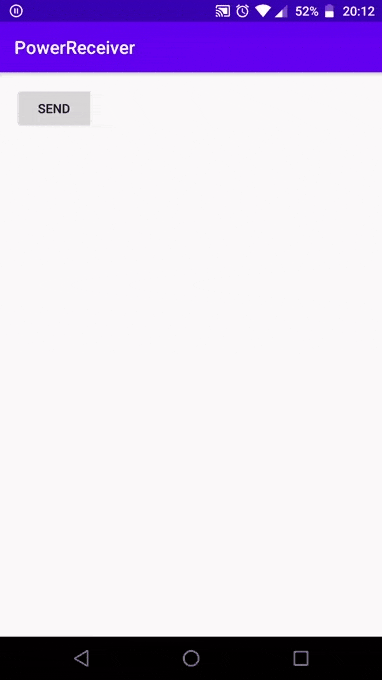
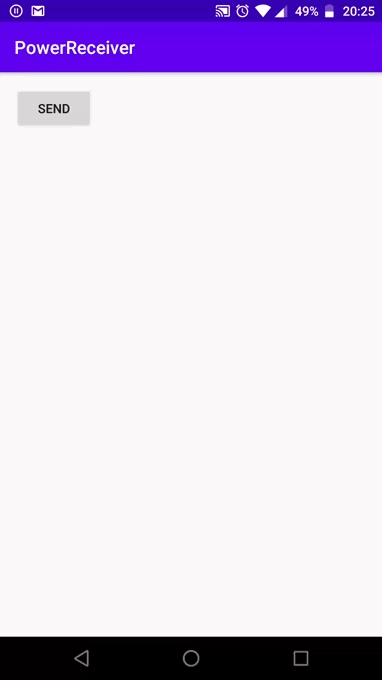

# BroadcastReceiverApp
Simple app to demonstrate System broadcast and custom broadcast in Kotlin

In this app 2 System Broadcasts are used:
>ACTION_POWER_CONNECTED

>ACTION_POWER_DISCONNECTED

In our case, broadcast will only be received when our app context is valid i.e app is running and MainActivity is visible.

When a charger is connected to a device, 1st system broadcast is sent to our receiver class and displays a 
Toast message "connected" and when a charger is removed, 2nd broadcast is sent and "disconnected" message is 
displayed.

Note: If you're using an emulator, toggle the power connection state by selecting the ellipses icon for the menu. 
Select Battery in the left bar, then use the Charger connection setting.

Send button is used to send a custom broadcast within our app. For custom broadcast, you need to create your own custom
action String containing app's package name in your MainActivity and BroadcastReceiver class.

>const val CUSTOM_ACTION = BuildConfig.APPLICATION_ID + " ACTION_TEST"

